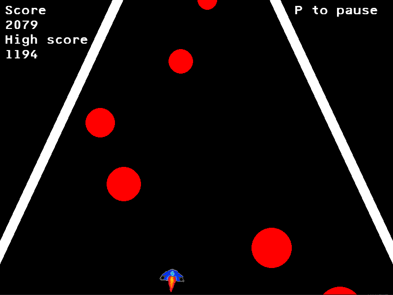
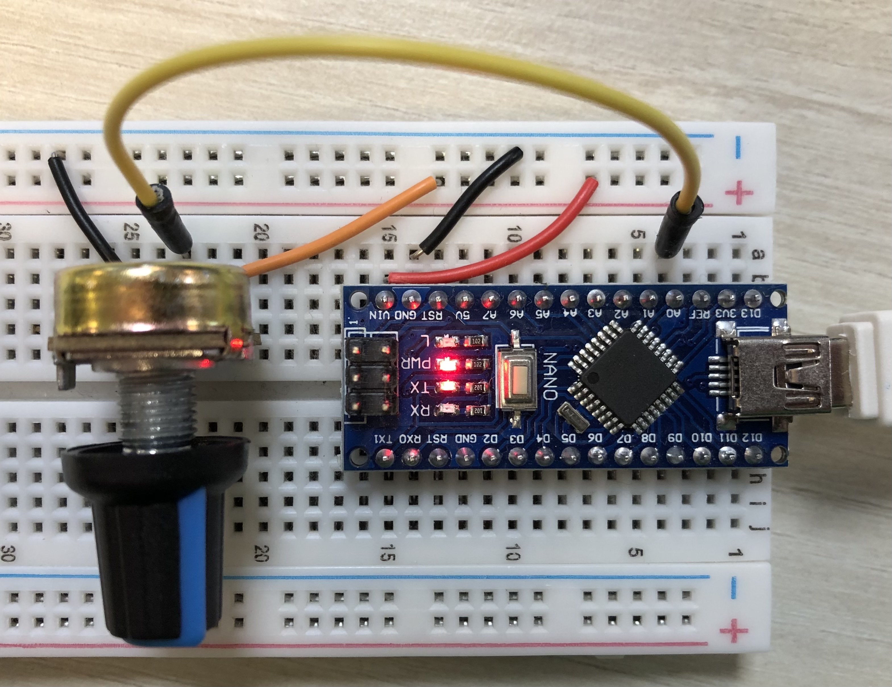
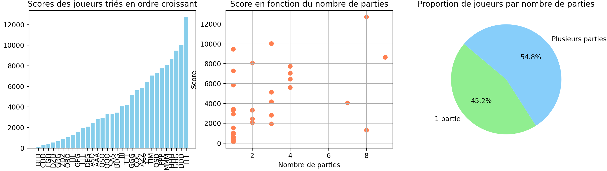

# Python rhythm-game



A rhythm-based dodging game created with Pygame where the player controls a spaceship to avoid obstacles. The spaceship can be controlled either by the keyboard or an external potentiometer connected to an Arduino Nano. The potentiometer setup is read via serial communication using the pyserial library.

## How It Works

The Arduino Nano reads the position of the potentiometer, and the game receives these values through the serial port. This allows the player to control the spaceship by adjusting the potentiometer.
Falling spheres appear at regular intervals. The player must avoid these spheres by moving the spaceship horizontally.

## Prerequisites

Python 3.7+
Pygame: Install with pip install pygame.
Pyserial: Install with pip install pyserial.
Arduino: Code uploaded to an Arduino Nano to read potentiometer values.

## Setup

1. **Clone the Repository**:

   ```bash
   git clone <repository-url>
   ```

2. **Install Required Packages**:

   ```bash
   pip install -r requirements.txt
   ```

3. **Arduino Setup**:
   - Build your circuit according to this image :
   
   - Upload a sketch to the Arduino Nano to read the potentiometer and send the analog value (0-1023) over serial.
   - Ensure the Arduino is connected to the correct COM port.
   - MAKE SURE THE RIGHT PORT IS SELECTED in the main.py (around line 20) :

```cpp
arduino = serial.Serial('COM7', 9600, timeout=1)
```

If you have any doubts, you can see which port is in use on your computer by running this command in your terminal :

```python
python -m serial.tools.list_ports
```

## Run the game

Go in the ./src directory and run :

```bash
python ./main.py
```

## About controls

When starting, the game scans for an arduino (with the right code uploaded on it) connected to the specified COM port. If connection is made, the game is then controlled by the MCU potentiometer. Whoever is the connection cannot be established, an error message will appear in the terminal. The game will still be playable but only using the arrow keys.

## Statistics

The statistics directory contains a script to help visualize the player data stored in the csv file.
When executed, it plots two graphs : the scores of all players by sorted by their highscore and the highscore compared to the number of games played.

To start this script use :
```bash
python .\stats.py
```
In the statistics directory.

